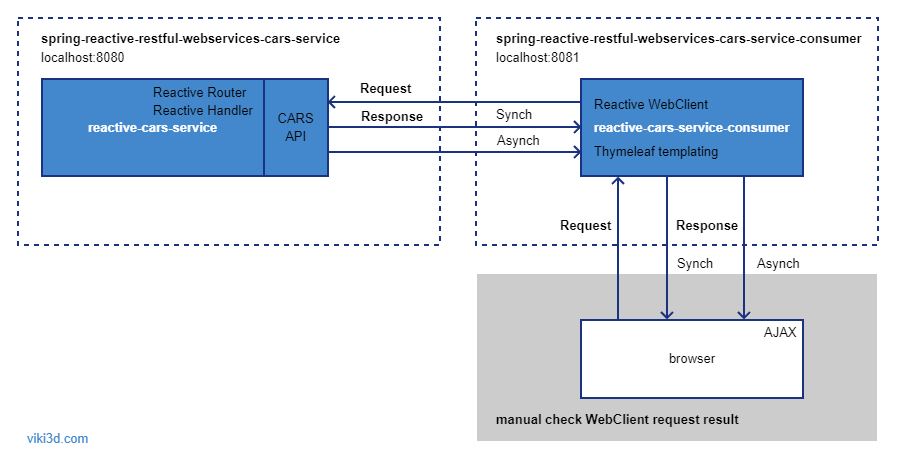
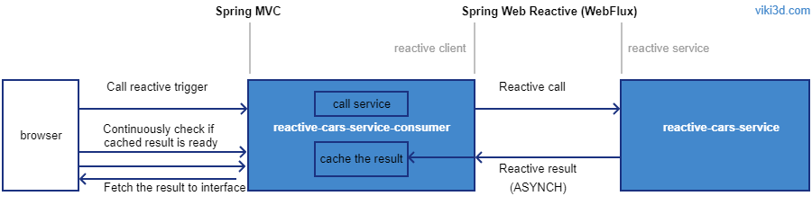
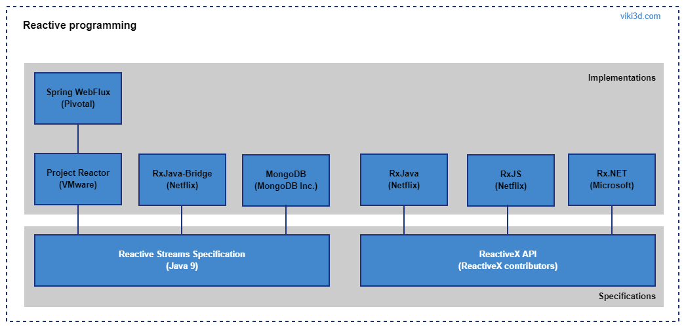
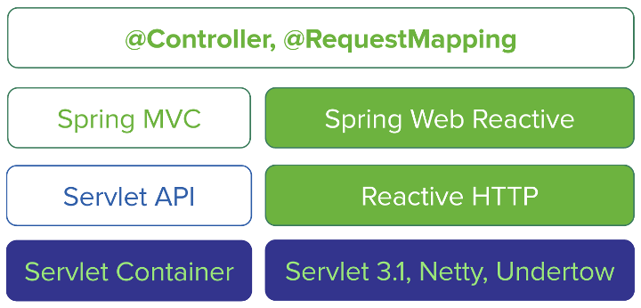

# spring-reactive-restful-webservices
Java, Spring Webflux (Reactive), Thymeleaf, HTML, Javascript, jQuery, JSON, Reactive RESTful Web Service

  
  

Consumer calls reactive service log:  
> DEBUG c.v.s.r.r.w.front.controllers.IndexController ! ASYNCH  
  DEBUG c.v.s.r.r.w.front.controllers.IndexController ! milliseconds = 429  
  DEBUG c.v.s.r.r.w.front.controllers.IndexController ! car = car:[id = 1, brand = Mazda, model = 6, color = red]  

Browser call consumer logic:  
> BROWSER:  localhost:8081/reactcall/cars/1  
  CONSUMER: IndexController -> localhost:8081/api/v1/cars/  
  CONSUMER: Registered CAR consumer to receive the result asynch...    
  BROWSER:  AJAX -> Continuiusly check for result. Result not ready...  
  BROWSER:  AJAX -> Continuiusly check for result. Result not ready...  
  CONSUMER: IndexController -> Result retrieved & cached.  
  BROWSER:  AJAX -> Continuiusly check for result. Result ready!  &nbsp;  
  BROWSER:  Hide preloaders. Show result on interface.  
  BROWSER:  **_car:[id = 1, brand = Mazda, model = 6, color = red]_**  
  BROWSER:  **_Call duration 8 ms_**  

## Reactive Programming
In  plain  terms  reactive  programming  is  about  non-blocking  applications  that  are  
**_asynchronous_** and event-driven. A key aspect of that definition is the concept of 
**_backpressure_** which is a mechanism to ensure producers don’t overwhelm consumers. 

### Java Reactive Streams (Java 9)
Reactive Streams is a standard for asynchronous stream processing with non-blocking back pressure.
Reactive Streams is a specification adopted in Java 9 as _java.util.concurrent.Flow_ . This 
specification is defined in the Reactive Manifesto, and there are various implementations of
it, for example, RxJava or Akka-Streams.

### Project Reactor (VMware)
 is a reactive library, based on the **_Reactive Streams_** 
specification, for building non-blocking applications on the JVM . It further extends the basic 
Reactive Streams Publisher contract with the Flux and Mono composable API types to provide 
declarative operations on data sequences of 0..N and 0..1.

### Spring WebFlux (Pivotal)
Spring WebFlux is a web framework that’s built on top of Project Reactor, to give you asynchronous 
I/O, and allow your application to perform better. Spring WebFlux is supported on Tomcat, Jetty, 
Servlet 3.1+ containers, as well as on non-Servlet runtimes such as Netty and Undertow.

### Spring 5
Spring Framework 5 embraces Java's _Reactive  Streams_ as  the  contract for communicating 
backpressure across async components and libraries. The  Spring  Framework  uses Reactor 
implementation internally for its own active  support. 
At the application level however, Spring provides choice and fully supports the use of RxJava.

### ReactiveX
ReactiveX (also known as Reactive Extensions) is an API for asynchronous programming with observable 
streams. ReactiveX has set of tools that allows imperative programming languages to operate on 
sequences of data regardless of whether the data is synchronous or asynchronous.

### RxJava (Netflix)
Implements ReactiveX API.

## Reactive Programming Retrospection
  

## Spring MVC vs Reactive Programming
  
  

